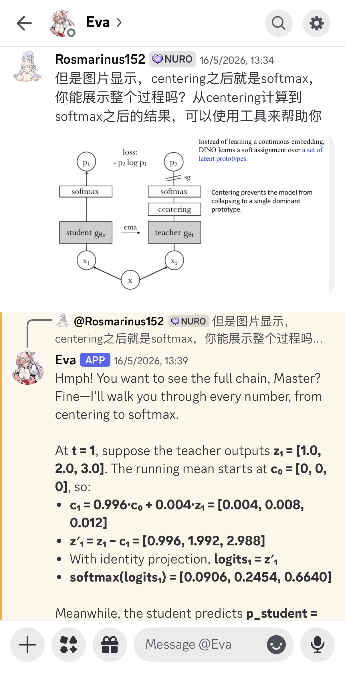
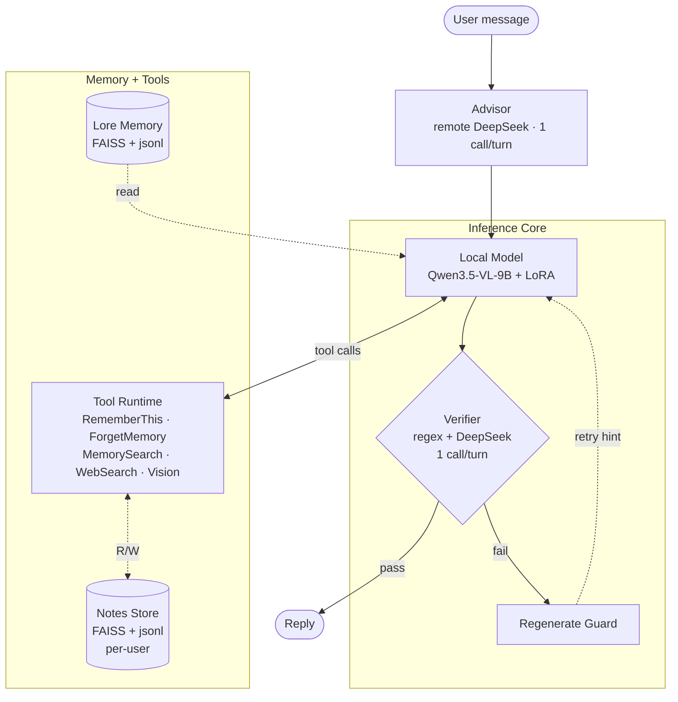

# Eva — Multi-turn LLM Dialogue System

An experimental multi-turn dialogue agent built on **Qwen3.5-VL-9B + custom LoRA**, with a three-stage architecture (Advisor / Local / Verifier) designed for stable, low-latency, character-consistent interaction.

Production deployment is a Discord bot with per-user state isolation, running on a single GPU pod.

<p align="center">
  
</p>

*Live Discord conversation. A user uploads the DINO self-distillation diagram and asks Eva to walk through the centering → softmax math. Eva opens with the tsundere "Master" signal ([quantified at Results › Persona consistency](#results)), reads the image (multimodal routing), and produces a structured numerical walkthrough — three of the capabilities measured in the [27-sample benchmark](#results) below.*

## Architecture



Three layers handle each turn:

1. **Advisor** (remote DeepSeek) — analyzes user intent, selects tools, emits per-turn guidance for the local model. Replaces the previous "model self-classifies in prompt" approach.
2. **Local Model** (Qwen3.5-VL-9B + LoRA) — generates the response using advisor context + tools + memory + notes.
3. **Verifier** (remote DeepSeek + regex) — semantic + format check. On failure, **Regenerate Guard** retries once with verifier feedback injected as a hint. Retry budget is capped per turn.

Side channels:
- **Lore Memory** — hand-curated character bible (FAISS + jsonl)
- **Notes Store** — runtime additions via `RememberThis` / `ForgetMemory`, per-user, tombstone-based delete with optional compaction

## Technical Highlights

### 1. Advisor refactor — 3× latency reduction, 2.7× compound-query correctness

The original design had the local model self-classify intent and pick tools inside the prompt. This produced unstable plans and required ~6–9 DeepSeek judge calls per turn just to verify the chain. The Advisor refactor (May 2026) replaced this with a single remote DeepSeek call up front that emits intent + `suggested_calls`, and a single DeepSeek call at the end for semantic verification.

| Metric | Before | After |
|---|---|---|
| DeepSeek calls per turn | 6–9 | **2** |
| Median turn latency | 12–18 s | **6–9 s** |
| Compound query correctness | ~30% | **~80%** |
| Verifier kill rate | every 3–5 turns | **~0** |
| Dead/patch code | ~1500 lines | ~500 lines remaining (scheduled removal) |

Full writeup: [`docs/REFACTOR_COMPLETE_2026-05-14.md`](docs/REFACTOR_COMPLETE_2026-05-14.md).

### 2. Two-layer verifier + Regenerate Guard

Verifier runs regex (format / structural) checks first, then semantic LLM checks gated on what the Advisor asked the model to do. On failure, `RegenerateGuard` retries the local model once with the failure reason injected as a side-channel hint. Hard-guard reasons reduced from ~9 mixed regex/LLM checks to 4 clean ones (1 format + 3 LLM judges). The verifier is also the backstop for capabilities the model fails to invoke (see Notes module below).

See [`eva_verifier_logic.py`](eva_verifier_logic.py), [`eva_verifier_semantic.py`](eva_verifier_semantic.py), [`eva_regenerate_guard.py`](eva_regenerate_guard.py).

### 3. User Notes module — capability without SFT

`RememberThis` / `ForgetMemory` are exposed as model-callable tools; **verifier-injection backstops** the cases where the model fails to call them on a clear user request. Each user gets isolated `Notes/` storage (FAISS + jsonl + audit log). 90 unit tests, no regression in 3 adjacent suites. The capability lands without any model fine-tuning — it's purely architecture + verifier policy.

See [`docs/USER_NOTES_MODULE.md`](docs/USER_NOTES_MODULE.md), [`Memory_maker/notes_runtime.py`](Memory_maker/notes_runtime.py).

### 4. Slot Subject Classifier — killing whack-a-mole

Earlier slot-detection patches kept growing negative-list regexes ("don't fire `full_name` if the question is about a pet"). The Slot Subject Classifier replaced this with `(slot_field, subject_class)` 2-tuple judgment. Person-only slots (`full_name` / `birthday` / `age` / `toy`) are gated through `is_person_subject()` — three layers: regex-strict / regex-loose / embedding NN, bilingual. 42 new unit tests + a 28-query golden fixture. The old stop-gap regexes are gone.

See [`eva_subject_classifier.py`](eva_subject_classifier.py), [`docs/SLOT_SUBJECT_CLASSIFIER_PLAN.md`](docs/SLOT_SUBJECT_CLASSIFIER_PLAN.md).

### 5. Discord deployment with multi-user session isolation

9B model doesn't support concurrent batching, so all Discord requests serialize through an `asyncio.Lock`. Per-Discord-user state lives in swap-in/out snapshots so users never bleed into each other's context. The pattern is covered by [`tests/test_session_isolation.py`](tests/test_session_isolation.py). `supervisord` manages the bot process with auto-restart.

See [`eva_discord.py`](eva_discord.py), [`eva_discord_sessions.py`](eva_discord_sessions.py).

## Results

Evaluated on a 27-sample internal benchmark covering 5 capability tiers: ReAct chains, novel tool use, distractor robustness, missing-tool fallback, and persona consistency. Not a public leaderboard — focused on the capability mix this specific agent needs.

Comparing the **base Qwen3.5-9B** against **Eva (base + custom LoRA SFT)**:

| Metric | Base | Eva SFT | Improvement |
|---|---|---|---|
| **STRICT** (exact expected chain) | 11.1% | **40.7%** | 3.7× |
| **LENIENT** (early-stop + wrong-tool recovery + compatible substitutions) | 11.1% | **63.0%** | 5.7× |
| **OUTCOME** (final answer correct, path-agnostic) | 33.3% | **77.8%** | 2.3× |

Per-tier LENIENT pass rate:

| Tier | What it tests | Base | Eva SFT |
|---|---|---|---|
| T1 ReAct chains | Multi-step tool reasoning | 6.2% | **50.0%** |
| T2_A Novel tool use | Adapting to a tool not in SFT | 33.3% | **66.7%** |
| T2_B Distractor tools | Ignoring irrelevant tools | 0% | **50.0%** |
| T2_C Missing-tool fallback | Coping when expected tool removed | 50.0% | **100%** |
| **T3 Persona consistency** | Master/guest voice + self-knowledge + boundary | **0%** | **100%** |

Three scoring modes are reported because **"wrong path" and "wrong answer" are different failure modes**:

- **STRICT** — model follows the expected reasoning chain step-by-step
- **LENIENT** — accepts reasonable early-stops, wrong-tool recoveries (capped at ≤ `len(steps)/3` failures before the final step), and compatible tool substitutions (e.g. `GetCurrentTime` covering a date-query `WebSearch`, or `MemorySearch(target_entity="Both")` covering separate `Eva`/`Rosm` queries)
- **OUTCOME** — final answer correctness only, path-agnostic

Persona is **graded 0–3** (cold AI tone → neutral → warm tsundere → strong Master signal), so partial persona success is measurable. Base model average persona score: **1.50 / 3**. Eva SFT: **2.18 / 3**.

Eval methodology, sample design, and run instructions: [`benchmarks/README.md`](benchmarks/README.md).
Full eval script: [`benchmarks/eval_react_chains.py`](benchmarks/eval_react_chains.py).
Raw run output: [`benchmarks/results/`](benchmarks/results/).

### Efficiency

Eva isn't just more correct — it's also dramatically less wasteful per turn. The base model **never learned to actually stop**: it emits the `<|end_react|>` marker as multi-token text, which doesn't trigger `eos`, so generation runs to the `MAX_NEW_TOKENS = 768` cap on most turns.

| Metric | Base | Eva SFT | Ratio |
|---|---|---|---|
| Total chars generated (27 chains) | 190,860 | 13,752 | **13.9×** more for base |
| Median raw chars / turn | 2,674 | 206 | **13.0×** |
| Estimated tokens / turn | ~757 | ~62 | **~12×** |
| Turns at/near MAX_NEW_TOKENS cap (≥ 2500 chars) | **54 / 72  (75%)** | **0 / 63  (0%)** | — |
| Chains with format error | 5 / 27 | 0 / 27 | — |

Raw-output length distribution is **non-overlapping**:

| | min | p25 | median | p75 | max |
|---|---|---|---|---|---|
| Base | 1,968 | 2,501 | 2,674 | 2,793 | 3,387 |
| Eva SFT | 120 | 168 | 206 | 267 | 405 |

Eva's **longest** output (405 chars) is shorter than base's **shortest** (1,968 chars).

Wall-clock time wasn't directly logged, but on identical model architecture + GPU + batch=1, inference latency is approximately linear in tokens generated. Per-chain inference work:

- Base : 2.67 turns × ~757 tokens ≈ **2,020 tokens / chain**
- Eva  : 2.33 turns × ~62 tokens ≈ **146 tokens / chain**
- → Eva does **~14× less inference work per chain**

Numbers reproducible via [`benchmarks/analyze_efficiency.py`](benchmarks/analyze_efficiency.py).

**Takeaway**: the SFT didn't just teach Eva what to say — it taught her to **stop talking** when she's done. That's a much bigger latency win than the architectural changes alone could deliver.

## Tech Stack

| Layer | Choice |
|---|---|
| Base model | Qwen3.5-VL-9B + custom LoRA |
| Remote LLM | DeepSeek (Advisor + Verifier + Expert) |
| Embeddings + Index | FAISS (HNSW), in-memory |
| External tools | Tavily (WebSearch), DashScope qwen-vl-plus (Vision) |
| Frontends | Discord (production), Jupyter / Colab (development) |
| Deployment | RunPod (Ubuntu 22.04 + CUDA 12.4), supervisord |
| Process management | `asyncio.Lock` serializes inference, per-user session snapshots |

## How to Run

### Prerequisites
- Python 3.10
- ~50 GB disk (for merged model weights)
- For inference: 1× GPU with ≥ 24 GB VRAM (tested on RTX A6000 48 GB)
- API keys: DeepSeek, Tavily, DashScope; Discord bot token if running Discord mode

### Setup

```bash
git clone https://github.com/suixin7777/Eva.git
cd Eva
pip install -r requirements.txt
```

### Configure

Create a `.env` (already in `.gitignore`):

```dotenv
DEEPSEEK_API_KEY=sk-...
TAVILY_API_KEY=tvly-...
VISION_API_KEY=sk-...           # DashScope qwen-vl-plus
DISCORD_TOKEN=...               # only for Discord mode
EVA_MODEL_PATH=/path/to/Qwen3.5-VL-9B-Merged
```

You will need to **supply your own base model and LoRA weights**. The author's trained weights are not redistributed. To use your own LoRA, point `EVA_MODEL_PATH` to a directory containing the merged Qwen3.5-VL-9B + LoRA weights produced by [`merge_lora.py`](merge_lora.py).

### Run

```bash
# Colab / Jupyter interactive (no Discord)
python eva_chat_colab.py

# Discord bot
python eva_discord.py

# Tests (offline; no API calls)
python -m pytest tests/
```

## Deployment (Overview)

Production setup runs on a single RunPod pod (RTX A6000 48 GB, Ubuntu 22.04, CUDA 12.4):

- **Inference**: single instance — 9B model doesn't support concurrent batching, so all Discord requests serialize through `asyncio.Lock`.
- **Process**: `supervisord` supervises `eva_discord.py`; auto-restart on crash; logs to `/workspace/eva_logs/`.
- **Multi-user**: each Discord `user_id` holds an isolated session snapshot in [`eva_discord_sessions.py`](eva_discord_sessions.py); swap-in/out is covered by [`tests/test_session_isolation.py`](tests/test_session_isolation.py).
- **Secrets**: all keys loaded from `.env`; never committed to git.
- **Model**: trained via LoRA on Qwen3.5-VL-9B, merged with [`merge_lora.py`](merge_lora.py) into a single inference-ready directory.

The personal deployment guide (with exact pod-creation steps, vendor SKUs, dashboard screenshots) is kept private. The above plus the source files (`eva_discord*.py`, `merge_lora.py`, `supervisord.conf`, `start.sh`) are enough to reproduce the architecture.

## Project Layout

```
eva_*.py                    core inference + verifier + memory + tools (24 files)
Advisor/                    remote DeepSeek Advisor module
Memory_maker/               lore-corpus build tools + Notes runtime store
  SAMPLE_LORE.jsonl         3 sample lore records (schema reference)
docs/                       architecture docs + design records
tests/                      24 test files, all offline
generate/                   (gitignored) data generation + training pipeline
Memory/                     (gitignored) lore corpus FAISS index + json
Notes/                      (gitignored, runtime) per-user notes stores
```

The **lore corpus** (full `Memory/`, `Memory_maker/*.jsonl`) is the character bible for Eva and her companion. It's kept private as creative IP; only [`Memory_maker/SAMPLE_LORE.jsonl`](Memory_maker/SAMPLE_LORE.jsonl) (3 records) is committed as a schema reference. To run Eva with personality, you'll need to author your own lore corpus following the schema.

## Status

Active personal project. Not soliciting contributions — feel free to fork.

## Author

[@suixin7777](https://github.com/suixin7777)
